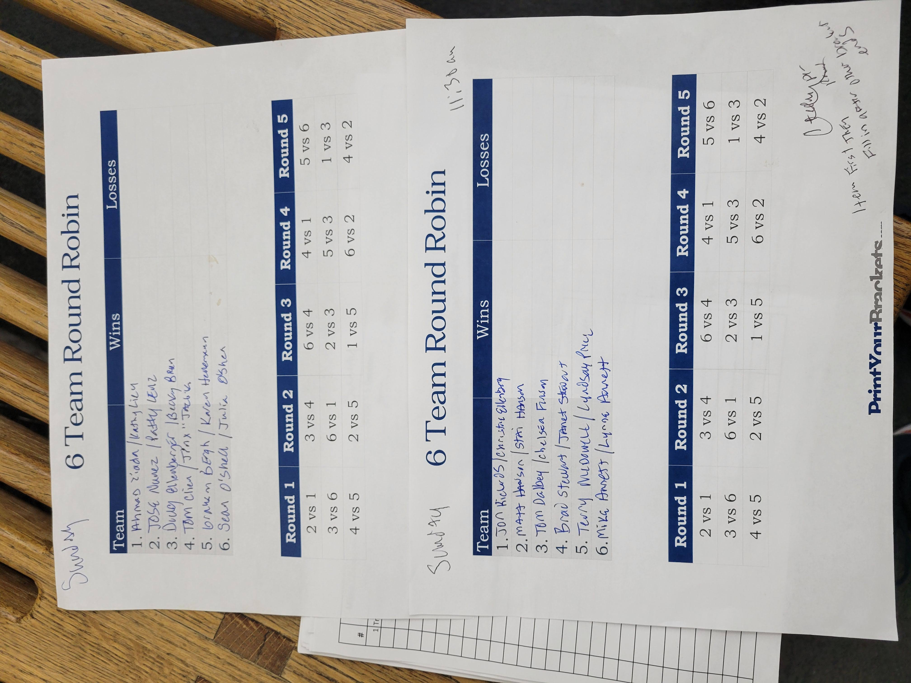

# PB Tourney — Reviewer Introduction

## Thank You

If you are reading this then most likely I have asked for your help, and you have said yes. Thank you for taking the
time to review PB Tourney. Your perspective as a player or director is essential in determining whether this project is
solving the *right* problems in the *right* way.

---

## Overview

Small informal tournaments often work well, but they place a lot of responsibility on the tournament director.

Common challenges include:

* Collecting registrations and setting up tournament schedule
* One person informally coordinating scores, match readiness, and questions
* Players checking in to report scores and/or ask about upcoming matches
* Sometimes limited visibility into standings during play

---

## What PB Tourney Is

PB Tourney is a **tournament management application** designed specifically for live execution of small, local
pickleball tournaments. It is designed primarily with the goal of reducing operational load on tournament directors by
addressing the following needs.

**Player needs:**

- A simple way to report match scores themselves
- Clear, up-to-date information about their next match (opponents and court)
- Visibility into standings and tournament progress during play

**Tournament Director needs:**

- A way to get players signed up before the tournament
- Tools to define format and other tournament details
- Help scheduling matches and assigning courts
- Accurate score tracking without having to personally field every update
- A system that helps tournaments keep moving with less manual coordination

---

## How to Review This

As you review PB Tourney, think about it from the perspective of someone *running* or *playing* in a real tournament.

Consider whether the problems described here match your experience, whether the objectives focus on what actually
matters during live play, and whether this approach would meaningfully improve tournament flow. Feedback of all kinds is
welcome — including ideas about features, usability, and polish — especially when tied back to real tournament needs.

---

## Future Direction

PB Tourney will be released as both a web application and a mobile application (iOS and Android). The mobile application
will focus initially on the player experience providing convenient access to score reporting, matches, and standings. I
haven't decided any details beyond that I will release version 1 in these formats. Please share any ideas/feedback you
have in this area as well if they occur to you.
